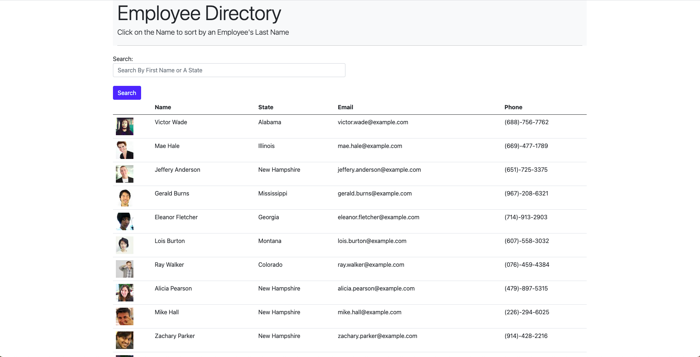
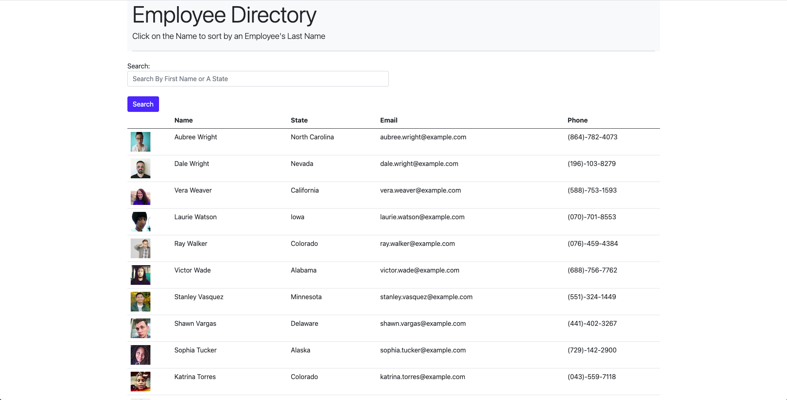
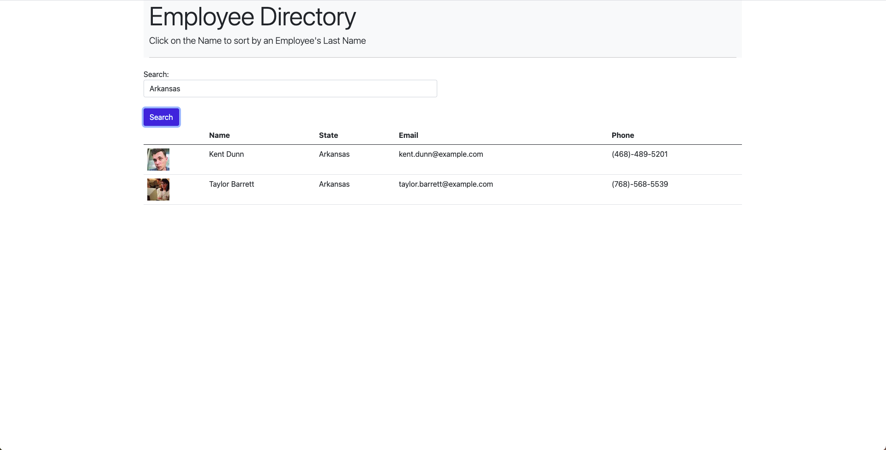
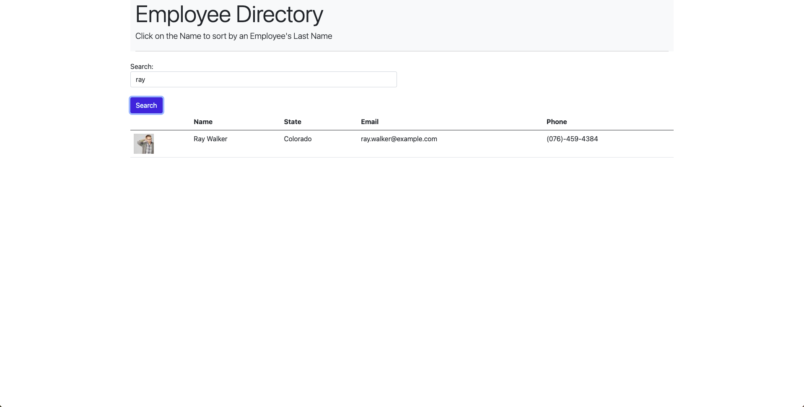

# user-directory


[](https://opensource.org/licenses/MIT)


## Table of Contents
- [Description](#Description)
- [Screenshots](#Screenshots)
- [User Story](#User-Story)
- [Acceptance Criteria](#Acceptance-Criteria)
- [Deployed Application URL](#Deployed-Application-URL)


## Description 
This is a user/employee directory app that is created with react. It allows the user to filter an employee or employees by first name or the state, where they live. It also allows the user to sort employees by last name in ascending or descending order. The assignment required to break up the application's UI into components, manage component state, and respond to user events in order to achieve the functionalities of this app. 


## Screenshots






## User Story 
```
* As a user, I want to be able to view my entire employee directory at once so that I have quick access to their information.
```


## Acceptance Criteria
```
Given a table of random users generated from the [Random User API](https://randomuser.me/), when the user loads the page, a table of employees should render. 

The user should be able to:

  * Sort the table by at least one category

  * Filter the users by at least one property.
```


## Deployed Application URL 
[User Directory](https://user-directory-app-deployed.herokuapp.com/)